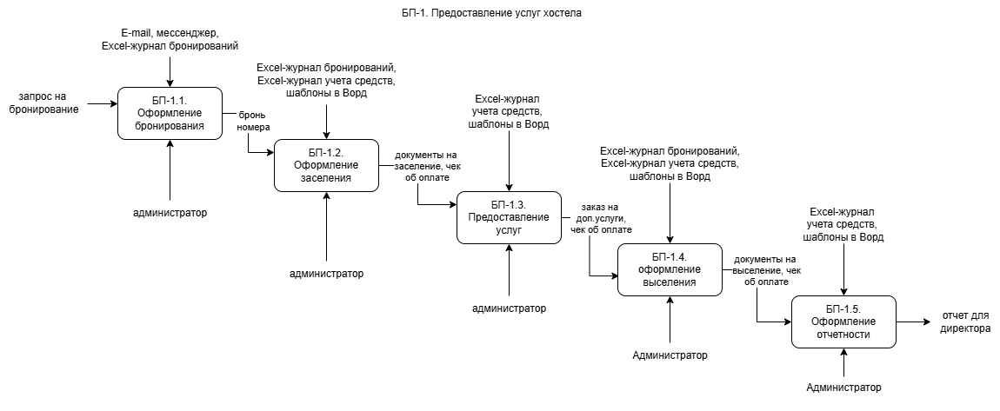

# 🏨 Диаграммы процессов хостела

## 📊 Обзор диаграмм

В репозитории представлены 4 диаграммы бизнес-процессов хостела в двух нотациях:

| Нотация | AS IS (текущее состояние) | TO BE (целевое состояние) |
|---------|---------------------------|---------------------------|
| **IDF0** |  [`hostel_as_is.drawio.png`](hostel_as_is.drawio.png) |  [`hostel_to_be.drawio.png`](hostel_to_be.drawio.png) |
| **BPMN** |  [`bpmn_as_is.drawio.png`](bpmn_as_is.drawio.png) |  [`bpmn_to_be.drawio.png`](bpmn_to_be.drawio.png) |

---

## 📋 Описание

### **IDF0 (Integrated DEFinition for Function Modeling)**
- **AS IS:** Текущая архитектура бизнес-процессов хостела
- **TO BE:** Оптимизированная архитектура процессов

### **BPMN (Business Process Model and Notation)**
- **AS IS:** Текущий процесс выселения гостей
- **TO BE:** Улучшенный процесс выселения

---

## 🛠️ Использование

- **Просмотр:** Нажмите на изображение или текстовую ссылку
- **Скачивание:** На странице файла используйте кнопку **Download**
- **Все файлы:** `hostel_as_is.drawio.png`, `hostel_to_be.drawio.png`, `bpmn_as_is.drawio.png`, `bpmn_to_be.drawio.png`

---

📚 Учебный проект по моделированию бизнес-процессов

